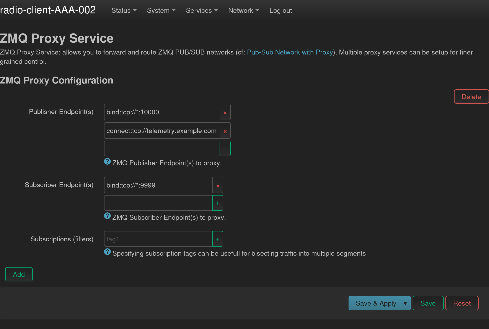

# ZMQ Proxy Service

This project implements a zmq proxy service which can be used to create a ZMQ infrastructure or can be used as a local development/troubleshooting tool.

 ‼️ DISCLAIMER ‼️

*This project is a prototype that has been built for quick deployment. It relies on custom built toolchains from [buildroot](https://buildroot.org/) because there was some device incompatibility from the device specific toolchains provided by openwrt project (specifically around compiler support). As a result of this, this project does not integrate into the recommended openwrt workflows (specifically Makefile driven ipk generation). This may or may not be addressed in the future depending on community uptake, however at present, the current project as it is hosted in this org has the CI to manually generate the necessary releases (for two specific devices: armv7 and mips_24kc). These toolchains can be found at [github.com/rabit-wisp/toolchain](https://github.com/rabit-wisp/toolchain)*

## Usage as a service

Usage as service is straightforward: a natively built binary will establish a `zmq_proxy` with any number of configurable endpoints. Endpoints can be used to create fan-in fan-out configurations, and backup pathsways.



## CLI usage

Package ships a binary `zmq-proxy` which will allow you setup a normal proxy bridge, or alternatively dump traffic to an output stream or even inject traffic onto the network using an input stream:

```bash
ZMQ Pub/Sub Proxy.

Usage:
  zmq-proxy --sub=SUBSCRIBER... --pub=PUBLISHER...
  zmq-proxy --stdin --pub=PUBLISHER...
  zmq-proxy --sub=SUBSCRIBER... (--stdout|--stderr) [--subscriptions=TAG1,TAG2,...] [--sub-method=(bind|connect)]

Options:
  --pub=SUBSCRIBER...            Publisher endpoint (e.g., connect:tcp://*:5555, bind:ipc://stdout).
  --sub=PUBLISHER...             Subscriber endpoint (e.g., connect:tcp://*:5556, bind:tcp://123:23).
  --stdin                        Take input from stdin and send over publisher endpoint
  --stdout                       Output subscriber data to stdout
  --stderr                       Output subscriber data to stderr
  --subscriptions=TAG1,TAG2,...  Subscribe to specific tags - uses XSUB (all messages) if none specified

Note: when dumping data from stdin, use part boundaries are null character delimited, and multi-part message terminators
are double null character delimited.
```

Example usages:

```bash
# tcpdump like traffic snooping:
zmq-proxy --stdout --sub=connect:tcp://some.endpoint.example.com:8888 | head -n 3

# dump all traffic relating to tag FOO from traffic into some dump file
zmq-proxy --stdout --sub=connect:tcp://some.endpoint.example.com:8888 --subscriptions=FOO > some-traffic.dump

# do some magic and re-send it

cat some-traffic.dump | zmq-proxy --stdin --pub=connect:tcp://some.endpoint.example.com:19191
```

## Development and building locally

### Building binaries

To build, do the following:

```bash
mkdir -p build/{x86,armv7,mips}
cd build/armv7
cmake -DCMAKE_TOOLCHAIN_FILE=../../cmake/toolchains/armv7l-toolchain.cmake ../../
make
# arm cross-compiled binaries are now in ./binaries/*
cd build/mips
cmake -DCMAKE_TOOLCHAIN_FILE=../../cmake/toolchains/mips-toolchain.cmake ../../
make
# mips cross-compiled binaries are now in ./binaries/*

cd build/x86
cmake ../../
make
# non-cross compiled libraries are in ./binaries/*
```

**Note on toolchains:** cmake toolchain fiels are provided and expect the buildroot toolchain to be placed in the project root directory. To see how they are configured and built, see [github.com/rabit-wisp/toolchain](https://github.com/rabit-wisp/toolchain).

`set(TOOLCHAIN_DIR "${CMAKE_CURRENT_LIST_DIR}/../../arm-buildroot-linux-musleabihf_sdk-buildroot/")`

### Building ipk's

The scripts found under `./scripts` will build the pakcages given that binaries have already been built. They are dumb scripts and do not manage dependencies at all.

### The whole thing

See workflow file `.github/workflows/main.yml` for an end-to-end build of the project.
